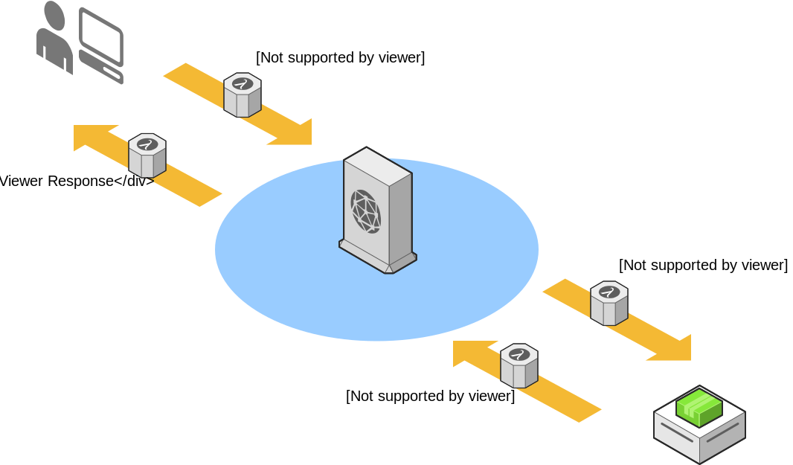

# A/B Testing Lambdas@Edge 

# Why?
As mentioned in the [documentation for CloudFront Lambdas limitations](https://docs.aws.amazon.com/AmazonCloudFront/latest/DeveloperGuide/lambda-requirements-limits.html#lambda-requirements-lambda-function-configuration)

> Environment variables aren't supported.

The reason I automated the functions generation was mainly to avoid human mistakes and centralize versioning of our A/B tests states.

# Overview

When executed, `build.sh` generates 3 functions to use on AWS lambdas@edge.  
Functions names match AWS default naming to avoid confusion.

The build simply loads the variables from the configuration file (`conf`) and replace the placeholders with the correct values.  
Along with the function files, 2 other files are built:
1. `build.json` containing the information of the current state.
1. `bookmarklet.js` a js function to use as a [bookmarklet](https://en.wikipedia.org/wiki/Bookmarklet) to alternate between experiments.

## Usage

1. Rename `conf.sample` to `conf` and update its values.
1. run `./build.sh`. Functions will be automatically placed into the `dist` folder.
1. [Create the lmabda functions](https://docs.aws.amazon.com/AmazonCloudFront/latest/DeveloperGuide/lambda-edge-how-it-works-tutorial.html) with the generated code.
1. **RUN TESTS!** 
1. Done! :cake:

## Bookmarklet shield

If you fork this repository and commit your `dist` folder here's a [shield.io](https://shields.io/) badge to dynamically pull information from `build.json` and expose the current bookmarklet on your README.md file. fancy right?!

# Considerations

- CF Origin should whitelist `source` header
- CF Origin should whitelist the cookie for the given `cookie_name`.
- Logs are region based. If you can't find them look into a closer region.
- When pointing to an S3 avoid `Host` on `Whitelist Headers`
    > If the bucket has a different name than the domain name
- Did I mention creating tests?

# Contributing

Contributions are welcome, and they are greatly appreciated! Every little bit helps, and credit will always be given.
